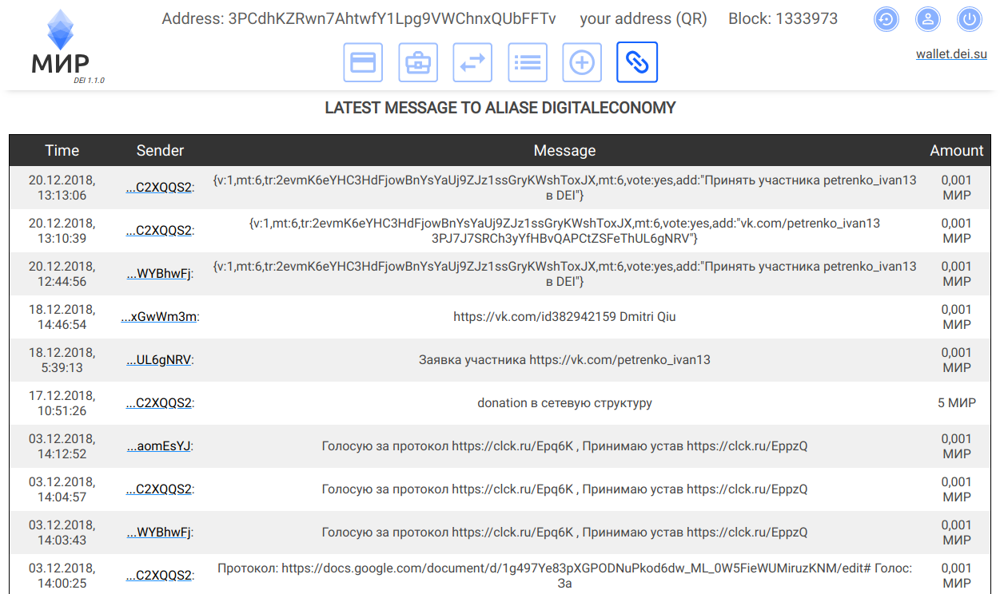

# client

Клиент для работы с ассетами проектов Института цифровой экономики им Глушкова (Digital Economy Institute, DEI) в сети Waves
 

* Загрузите и распакуйте zip в любой каталог
* Откройте **index.html** в браузере.
* Начните использовать Client!
  

**_Имейте в виду, что в Client используется локальное хранилище вашего браузера для надежного хранения данных ваших учетных записей. Локальное хранилище браузера привязано к URL-адресу страницы, поэтому в этом случае это будет путь к index.html. Это означает, что если вы загрузите следующую версию Client, убедитесь, что вы распаковываете архив в каталог предыдущей версии. В противном случае путь к index.html изменится, и вы не сможете просмотреть свои сохраненные учетные записи._**

## Передача сообщений через блокчейн

:octocat: [@inozemtsev-roman](https://github.com/inozemtsev-roman)
:octocat: [@prof1983](https://github.com/prof1983)
